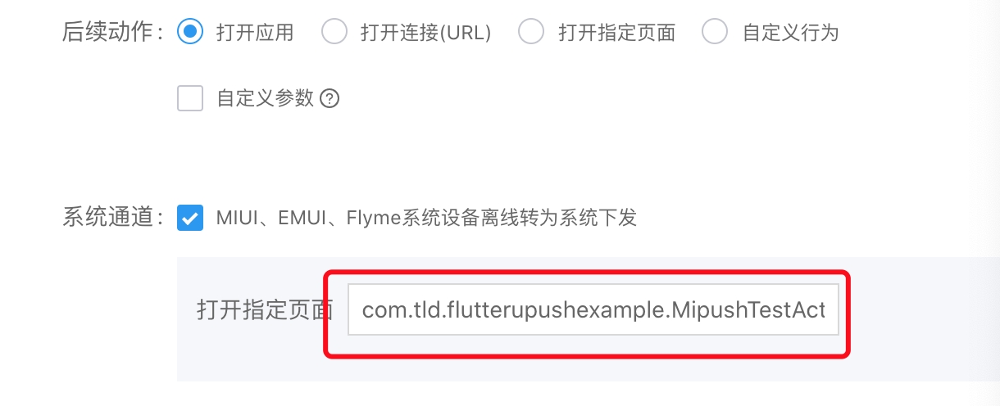

# UmengPush Flutter Plugin


## Android:
### 第一步：
在 `android/app/build.gradle `中添加下列代码：

注意`manifestPlaceholders `里面的值格式一定是：@xxxxxx，@不能省略，省略了就会注册失败。

```
android: {
  ....
  defaultConfig {
    applicationId "替换成自己应用 ID"
    ...
  manifestPlaceholders = [
                UMENG_APPKEY : "@替换成UMENG_APPKEY",
                UMENG_MESSAGE_SECRET : "@替换成UMENG_MESSAGE_SECRET",
                UMENG_CHANNEL : "UMENG",
                XIAOMI_APPID : "@替换成XIAOMI_APPID",
                XIAOMI_APPKEY : "@替换成XIAOMI_APPKEY",
                VIVO_APPKEY : "@替换成VIVO_APPKEY",
                VIVO_APPID : "@替换成VIVO_APPID",
                OPPO_APPSECRET : "@替换成OPPO_APPSECRET",
                OPPO_APPKEY : "@替换成OPPO_APPKEY",
                HUAWEI_APPID :"@替换成HUAWEI_APPID",
                MEIZU_APPID :"@替换成MEIZU_APPID",
                MEIZU_APPKEY : "@替换成MEIZU_APPKEY"
        ]
  }
}
```

如果没有申请某个厂商通道，就不用配置，例如：没有申请OPPO推送，就放空处理

```
android: {
  ....
  defaultConfig {
    applicationId "替换成自己应用 ID"
    ...
  manifestPlaceholders = [
                UMENG_APPKEY : "@替换成UMENG_APPKEY",
                UMENG_MESSAGE_SECRET : "@替换成UMENG_MESSAGE_SECRET",
                UMENG_CHANNEL : "UMENG",
                XIAOMI_APPID : "@替换成XIAOMI_APPID",
                XIAOMI_APPKEY : "@替换成XIAOMI_APPKEY",
                VIVO_APPKEY : "@替换成VIVO_APPKEY",
                VIVO_APPID : "@替换成VIVO_APPID",
                OPPO_APPSECRET : "",//没有申请OPPO推送，就放空处理
                OPPO_APPKEY : "",//没有申请OPPO推送，就放空处理
                HUAWEI_APPID :"@替换成HUAWEI_APPID",
                MEIZU_APPID :"@替换成MEIZU_APPID",
                MEIZU_APPKEY : "@替换成MEIZU_APPKEY"
        ]
  }
}
```

### 第二步：


做SDK代码初始化工作，所以自定义的Application需集成 UPushApplication，例如：
```
public class MyApplication extends UPushApplication {

}
```
然后在AndroidManifest.xml中配置该MyApplication，例如：

```
<manifest>
 ...
    <application
        android:name="替换成自己应用的包名.MyApplication"
       >
</manifest>
```
## 注意事项 

```
 要给软件授权 "获取手机信息"，不然getRegistrationId会获取不了值。
```

## 注册成功标记
```
小米Push通道
注册成功后会在tag：MiPushBroadcastReceiver下面打印log： onCommandResult is called. regid= xxxxxxxxxxxxxxxxxxxxxxx接收到小米消息则会打印log： onReceiveMessage,msg= xxxxxxxxxxxxxxxxxxxxxxx
```

```
华为Push通道
注册成功后会在tag：HuaWeiReceiver下面打印log： 获取token成功，token= xxxxxxxxxxxxxxxxxxxxxxx接收到华为消息则会打印log： HuaWeiReceiver,content= xxxxxxxxxxxxxxxxxxxxxxx

```

```
魅族Push通道
注册成功后会在tag：tag：MeizuPushReceiver下面打印log： onRegister, pushId=xxxxxxxxxxxxxxxxxxxxxxx
```

```
OPPO厂商通道
是否注册成功, 可以通过过滤OppoPush关键字查看, 注册成功会打印onRegister regid=**相关日志, 否则检查参数是否正确填入
```

```
vivo Push通道
是否注册成功, 可以通过过滤PushMessageReceiver关键字查看
```
### 详细后台配置可以看 [友盟配置文档](https://developer.umeng.com/docs/67966/detail/98589)


## 离线下发指定页面
把 `com.wsl.upush.UPushOffLineNotificationActivity` 填入下图框中



## iOS: 
### [去苹果官网申请各种证书](https://developer.apple.com/)
```
1.申请项目的ID：Account-->Certificates, Identifiers & Profiles-->Identifiers
2.申请项目的开发证书:Account-->Certificates, Identifiers & Profiles-->Certificates-->download
3.申请项目的描述文件：Account-->Certificates, Identifiers & Profiles-->Profiles-->download
4.在项目添加支持推送功能：TAGETS-->项目-->Capability-->Push Notifications
```
## 注意事项 
```
 项目要支持推送功能，不然getRegistrationId会获取不了值。
```

